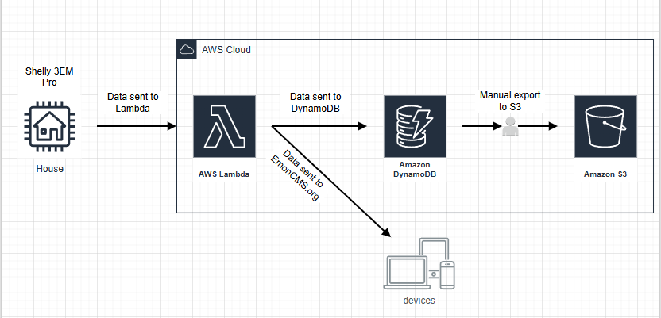

# Energy-Monitor

A personal IoT project that collects single-phase energy data from a Shelly EM device, processes it using an AWS Lambda function, and forwards aggregated metrics to [Emoncms](https://emoncms.org/) and **DynamoDB** for visualization and storage.

---

## 🚀 Introduction

This repository demonstrates a complete end-to-end solution for monitoring energy consumption, production, and battery behavior in a home or small industrial setup:

1. A **Shelly EM** device gathers real-time current, voltage, power, and frequency data for the single phase.
2. A **mScript** script running on the device invokes a lightweight **AWS Lambda** endpoint at configurable intervals.
3. The Lambda function, written in **Python**, normalizes readings, computes key metrics (production, consumption, import/export, battery charging/discharging), and pushes data to **Emoncms** and **DynamoDB**.

---

## 🔧 Architecture



1. **Shelly EM Script** (`scripts/shelly.js`) polls the device via `EM.GetStatus` and triggers `HTTP.GET` to the Lambda URL.
2. **AWS Lambda Function** (`lambda/Shelly_Script.py`) parses parameters, normalizes values, computes energy flows, and forwards payloads to Emoncms and DynamoDB.
3. **Emoncms** provides real-time dashboards.
4. **DynamoDB** stores time-series metrics for analytics.

---

## 📂 Repository Structure

```
├── Assets/
│   └── Shelly_to_AWS.drawio.png   # Architecture diagram
│
├── Scripts/
│   └── shelly.js                 # Embedded mScript for Shelly EM
│
├── Lambda/
│   └── Shelly_Script.py          # AWS Lambda handler
│
├── README.md                     # Project landing page
└── LICENSE                       # MIT License
```

---

## ✅ Features

- **Real-time polling**: Configurable interval (default 1 second) for high-resolution energy data capture.
- **Data normalization**: Zero-flattening and sign-handling for clean metrics.
- **Energy flow calculations**: Derived values for consumed, produced, imported, exported, and battery behavior.
- **Serverless ingestion**: AWS Lambda Function URL without API Gateway.
- **Dual outputs**: Pushes to Emoncms for visualization and to DynamoDB for persistent storage.

---

## 🛠 Tech Stack

- **mScript**: Shelly device scripting language
- **Python 3.9+**: Lambda function runtime
- **AWS Lambda Function URLs**: Serverless ingestion endpoint
- **DynamoDB**: NoSQL time-series storage
- **Emoncms**: Open-source energy monitoring platform

---

## 📄 License

This project is licensed under the MIT License. See [LICENSE](./LICENSE) for details.
